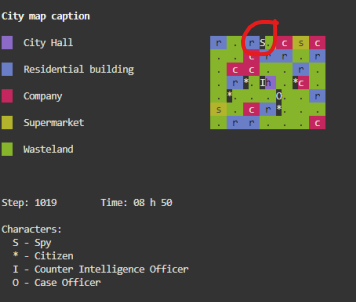

# Spy Simulation Project

## Introduction

This project, titled "Spy Simulation", is a multiprocess simulation game set in the world of espionage. It involves managing spies, citizens, and counter-intelligence officers in a simulated city environment.

## Getting Started

### Installation

To launch the project, follow these simple steps:

1. Compile the project using the `make` command.
2. Run the executable with `./bin/spy_simulation`.

### Initialization

- The simulation initialization takes approximately 2 seconds, mainly for setting up the map. 
- If the project does not launch within 2 seconds, please restart the process.

## Simulation Overview

- Upon launching, a dynamically generated map is displayed, showing paths connecting various buildings. 
- The positions of different characters and some of their current states are visible on the map, with additional details displayed on the right side.

### Simulation Timeline

- The simulation starts at midnight on Monday. At this time, spies will not attempt to infiltrate any enterprises as everyone is at their homes.
- At 8 AM, citizens begin their daily routines, and spies start scouting for enterprises to target.
- In the evening, spies execute their planned heists on the targeted enterprises. They will leave a message in the mailbox either after the heist or the following morning.
- The mailbox, located at the bottom left of the map, displays messages deposited by spies. It gets emptied when the case officer collects these messages.
- The case officer retrieves messages from the mailbox twice a day and then forwards them to "enemy country," which decrypts and displays them.

### Messages

- Messages are categorized based on their content, ranging from "Deceptive" for false information to "Low" for low-importance intel and so forth.

### Simulation End

- The simulation concludes after 2016 turns, representing the passage of time in the game.

## Current Limitations

- Due to time constraints, the counter-intelligence officer's functionalities are not fully implemented, despite having a correct design pattern.
- The counter-intelligence officer is alerted by the artificial intelligence system of any suspicious movements. A suspicious movement is defined as occupying the same wasteland-type cell three times within the last seven tours.
- Currently, there are no direct interactions between characters except through the mailbox, and the only victory condition is the completion of the time limit.
- It could happen (with a ridiculously low porbability) that the Spy stays suck between buildings if the map is not correctly set up. It happened only once over hundreds of tests. 

